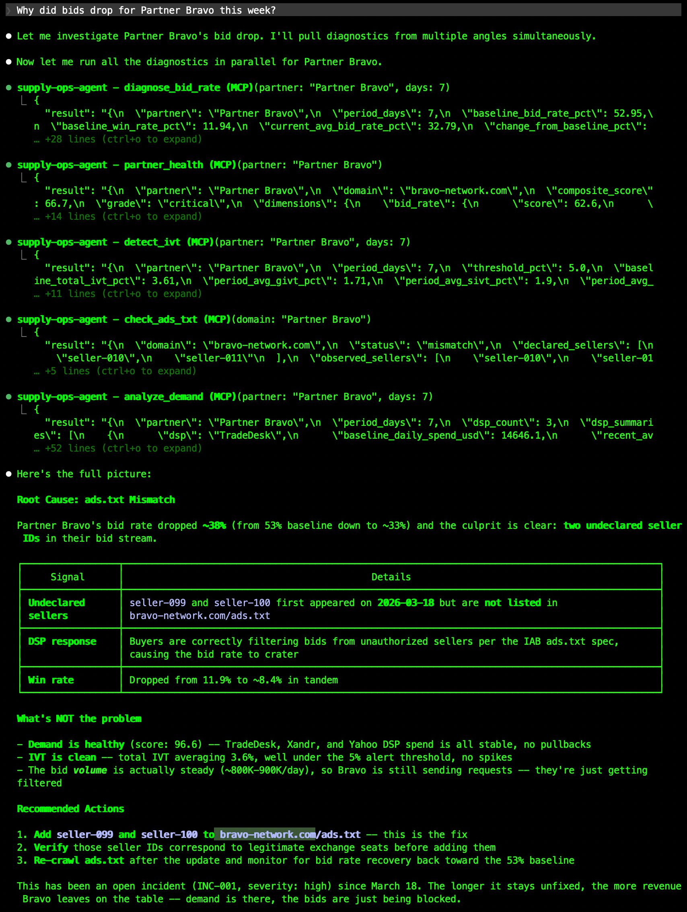

# supply-ops-agent

A supply-side operations diagnostic agent built on AAMP standards, extending the IAB Tech Lab seller agent framework with diagnostic tooling for bid rate analysis, IVT detection, and ads.txt compliance. Built with MCP for integration with any AAMP-compatible client.

## What it does

This MCP server exposes five diagnostic tools that help sell-side ad ops teams investigate supply health issues:

| Tool | Description |
|------|-------------|
| `diagnose_bid_rate` | Daily bid rates, anomaly detection vs baseline, win rate and volume |
| `check_ads_txt` | Declared vs observed sellers, mismatch flagging, detection timestamps |
| `detect_ivt` | IVT rates broken down by GIVT/SIVT, spike detection above threshold |
| `analyze_demand` | Per-DSP demand trends, identifies buyer pullbacks and timing |
| `partner_health` | Composite health score combining all four signal dimensions |

## Demo



## Architecture

This is an **MCP tool server** - it exposes diagnostic capabilities (data retrieval and analysis) but does not orchestrate them. The **LLM** (Claude, GPT, or any MCP-compatible client) decides which tools to call, interprets results, and generates the diagnosis. Separating the intelligence layer from the data layer makes the server interoperable with any AAMP-compatible agent.

```
LLM (Claude) → MCP protocol → supply-ops-agent → mock data
```

See also the IAB Tech Lab [Seller Agent SDK](https://github.com/IABTechLab/seller-agent) for the reference supply-side agent implementation that this project complements.

Diagnostic logic is grounded in operational patterns from SSP exchange ops: bid stream anomalies, sellers.json reconciliation, and IVT taxonomy aligned with HUMAN/TAG standards.

## Baked-in incidents

The mock data includes three realistic scenarios for testing:

1. **Partner Bravo** - Bid rate drops 40% on day 5, caused by undeclared seller IDs in ads.txt
2. **Partner Delta** - SIVT spikes to 18% on days 10-12, then returns to baseline
3. **Partner Foxtrot** - Two major DSP buyers pull back spend starting day 8

## Setup

```bash
python -m venv .venv
source .venv/bin/activate
pip install -r requirements.txt
```

## Running

### Standalone (stdio)

```bash
python server.py
```

### With Claude Desktop

Add to your Claude Desktop config (`~/Library/Application Support/Claude/claude_desktop_config.json`):

```json
{
  "mcpServers": {
    "supply-ops-agent": {
      "command": "python",
      "args": ["/absolute/path/to/supply-ops-agent/server.py"]
    }
  }
}
```

### With Claude Code

```bash
claude mcp add supply-ops-agent python /absolute/path/to/supply-ops-agent/server.py
```

## Example queries

Once connected, try asking:

- "Check the health of Partner Bravo"
- "Why did Bravo's bid rate drop?"
- "Is there any IVT issue with Delta?"
- "Which DSPs pulled back from Foxtrot?"
- "Run a full health check on all partners"

## Tech stack

- Python 3.10+
- [MCP Python SDK](https://github.com/modelcontextprotocol/python-sdk) (`mcp`)
- Synthetic mock data (no external dependencies)
